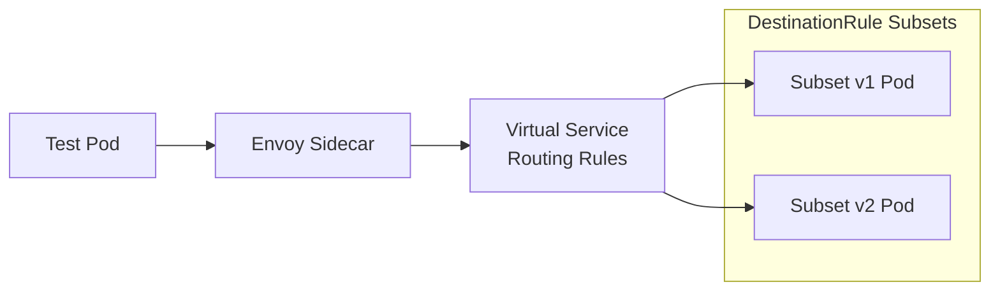
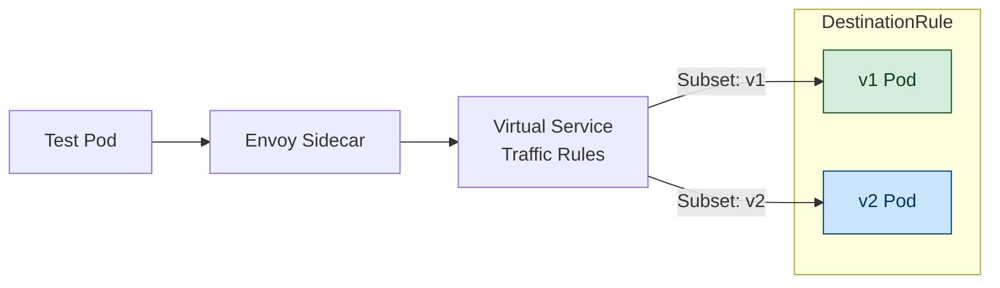
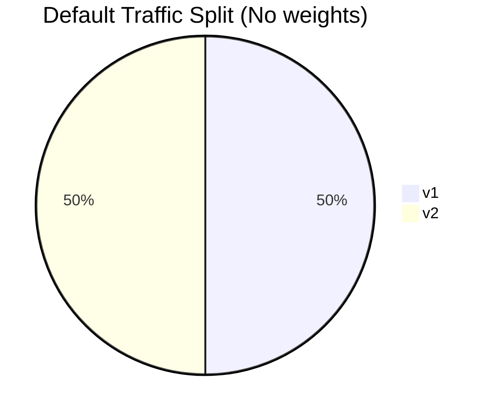
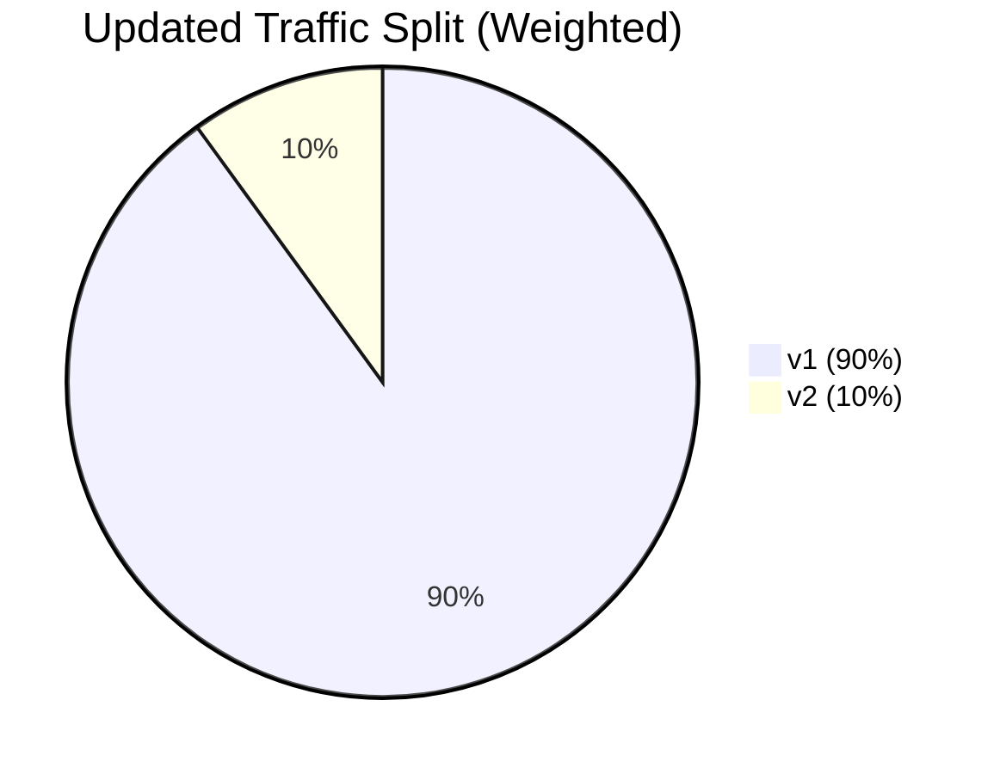

# 🚀 Destination Rules Lab

Welcome to the **Destination Rules Lab**.
By the end of this lab, you will understand how to configure **Destination Rules** and **Virtual Services** to control service-to-service traffic in the **Istio Service Mesh**.

---

# 🧭 1. Verify Namespace Labels

```bash
kubectl get ns --show-labels
```

Example output:

```
NAME              STATUS   AGE     LABELS
default           Active   34m     istio-injection=enabled,kubernetes.io/metadata.name=default
istio-system      Active   2m52s   kubernetes.io/metadata.name=istio-system
...
```

---

# 📦 2. Deploy the Hello World Application

```bash
kubectl apply -f https://raw.githubusercontent.com/istio/istio/master/samples/helloworld/helloworld.yaml
```

Verify deployments:

```bash
kubectl get deployments.apps
```

```
helloworld-v1   1/1   Running
helloworld-v2   1/1   Running
```

Check services:

```bash
kubectl get svc
```

---

# 🧊 **Architecture Diagram: HelloWorld App**





# 🧪 3. Verify Sidecar Injection

Both pods should show **2/2** containers:

```bash
kubectl get pods
```

```
helloworld-v1   2/2 Running
helloworld-v2   2/2 Running
```

---

# 🧰 4. Create Test Namespace and Pod

```bash
kubectl create ns test --dry-run=client -o yaml > test_ns.yaml
kubectl apply -f test_ns.yaml

kubectl run test --image=nginx -n test --dry-run=client -o yaml > test_pod.yaml
kubectl apply -f test_pod.yaml
```

Verify:

```bash
kubectl get ns test --show-labels
kubectl get po -n test
```

---

# 🌐 5. Verify HelloWorld Service

```bash
kubectl get svc helloworld
```

```
PORT(S): 5000/TCP
```

---

# 🧭 6. Test Connectivity from Test Pod

```bash
kubectl exec -ti -n test test -- curl helloworld.default.svc.cluster.local:5000/hello
```

Example output (round-robin default):

```
Hello version: v1...
Hello version: v2...
```

---

# 🏷️ 7. Review Pod Labels

```bash
kubectl get pods --show-labels
```

Confirms:

* v1 → `version: v1`
* v2 → `version: v2`

These labels are critical for routing.

---

# 📤 8. Export the HelloWorld Service Definition

```bash
kubectl get svc helloworld -o yaml > helloWorldSvc.yaml
```

> Only `.spec.selector` determines routing.
> Additional labels do **not** affect traffic.

---

# 🎯 9. Apply Destination Rule

```bash
kubectl apply -f destinationRules.yaml
```

Validate:

```bash
kubectl get destinationrules
```

```
hello-world-ds   helloworld
```

---

# ⚙️ 10. Apply the Virtual Service

```bash
kubectl apply -f virtualService.yaml
kubectl get vs
```

```
HOSTS: ["helloworld"]
```

This will control traffic between v1 and v2.

---

# 🔀 **Diagram: DestinationRule + VirtualService Routing**



---

# 🔁 11. Test Default 50/50 Traffic Split

```bash
kubectl exec -ti -n test test -- curl helloworld.default.svc.cluster.local:5000/hello
```

Expected alternating output:

```
Hello version: v1...
Hello version: v2...
```

---

# 📊 **Diagram: Default 50/50 Split**



---

# 🎚️ 12. Update Virtual Service to 90/10 Split

Modify VirtualService:

* **90% → v1**
* **10% → v2**

Apply:

```bash
kubectl apply -f virtualService.yaml
```

Test repeatedly:

```bash
kubectl exec -ti -n test test -- curl helloworld.default.svc.cluster.local:5000/hello
```

Expected distribution:

* v1 ≈ 90%
* v2 ≈ 10%

---

# 📊 **Diagram: 90/10 Weighted Routing**



---

# 🎉 Conclusion

You have successfully learned how to:

✅ Deploy a multi-version service
✅ Apply a **Destination Rule** with subsets
✅ Create a **Virtual Service** to route traffic
✅ Perform traffic splitting (50/50 → 90/10)
✅ Verify behavior using curl from inside the mesh

**Destination Rules + Virtual Services = powerful, fine-grained traffic control in Istio.**

