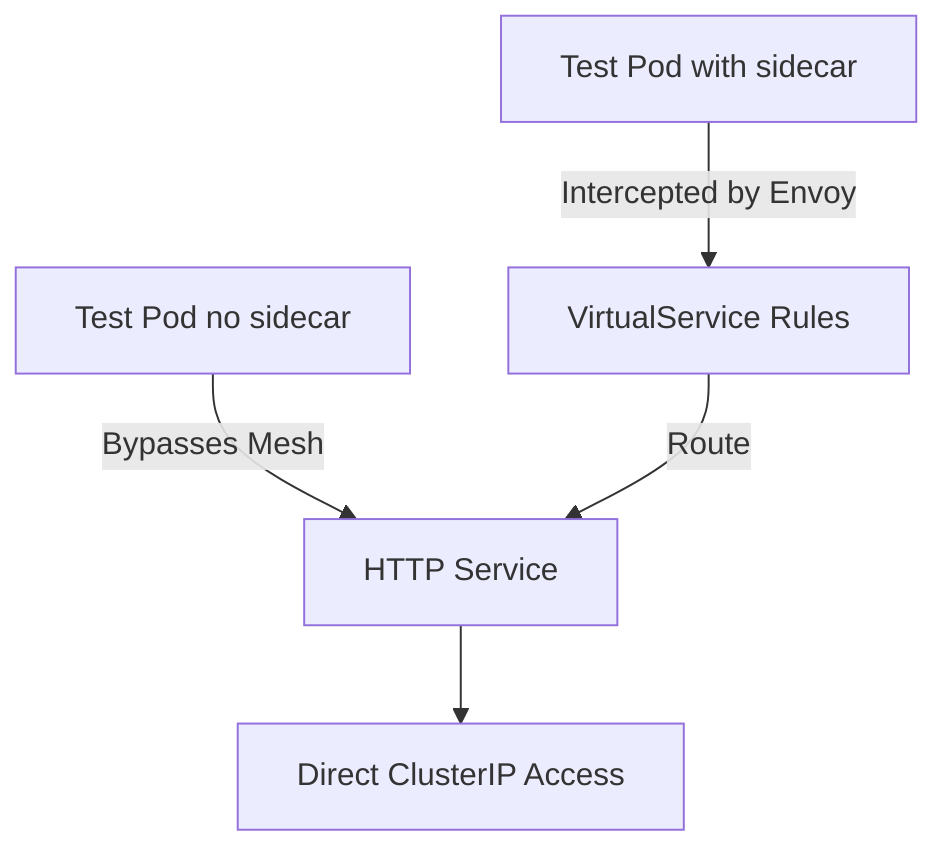
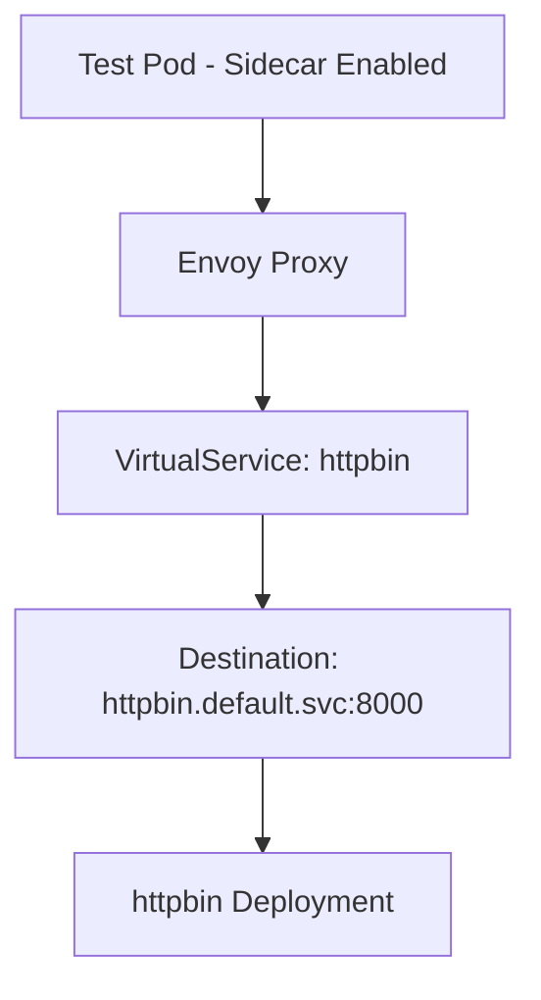
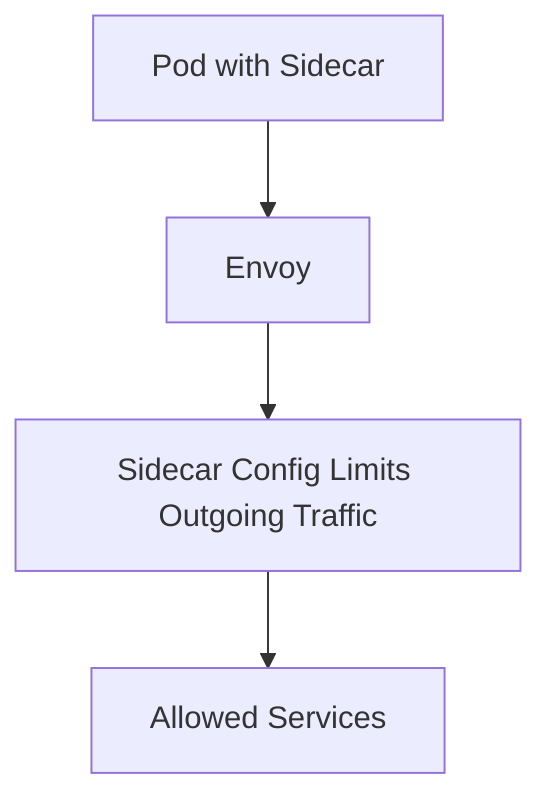
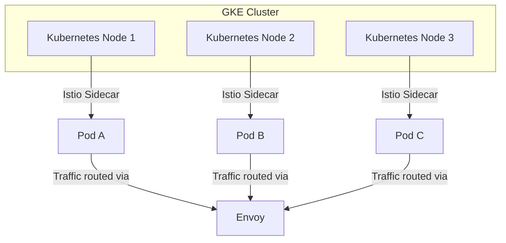

# 🌐 Istio on GKE – Demo Guide

This guide demonstrates **Istio traffic management, Virtual Services, Destination Rules, and Sidecars** deployed on **Google Kubernetes Engine (GKE)**.

---

## ⚙️ Prerequisites

* GKE cluster with Istio installed
* kubectl configured for your cluster
* Istio CLI (`istioctl`) installed

---

## 🚀 Deployment Steps

### 1️⃣ Verify Istio-Enabled Namespaces

```bash
kubectl get ns --show-labels
```

Expected output:

```
default      Active   istio-injection=enabled
istio-system Active
```

---

### 2️⃣ Deploy Sample Applications

#### HTTPBin

```bash
kubectl apply -f https://raw.githubusercontent.com/istio/istio/master/samples/httpbin/httpbin.yaml
kubectl get pods
```

#### HelloWorld

```bash
kubectl apply -f https://raw.githubusercontent.com/istio/istio/master/samples/helloworld/helloworld.yaml
kubectl get pods
```

---

### 3️⃣ Create Test Namespace & Pods

```bash
kubectl create ns test
kubectl run test --image=nginx -n test
kubectl run nginx --image=nginx -n test
```

Enable Istio injection for the test namespace:

```bash
kubectl label namespace test istio-injection=enabled
kubectl delete pod -n test test
kubectl delete pod -n test nginx
kubectl run test --image=nginx -n test
kubectl run nginx --image=nginx -n test
```

---

### 4️⃣ Apply Istio Resources

Apply Virtual Services, Destination Rules, Sidecars, and PeerAuthentication as required.

---

### 5️⃣ Test Connectivity

```bash
kubectl exec -ti -n test test -- curl --head httpbin.default.svc.cluster.local:8000
kubectl exec -ti -n test test -- curl helloworld.default.svc.cluster.local:5000/hello
```

---

## 📊 Architecture Diagrams (GKE + Istio)

### 1️⃣ Istio High-Level Flow (Pods with & without Sidecar)



---

### 2️⃣ Virtual Service Routing Logic



✅ This **renders correctly on GitHub**.

If you want, I can **rewrite all your Istio Virtual Service README diagrams** in this fully GitHub-compatible format so every diagram works properly.

Do you want me to do that?

```

---

### 3️⃣ Sidecar Traffic Control



---

### 4️⃣ GKE Cluster + Istio Overview



