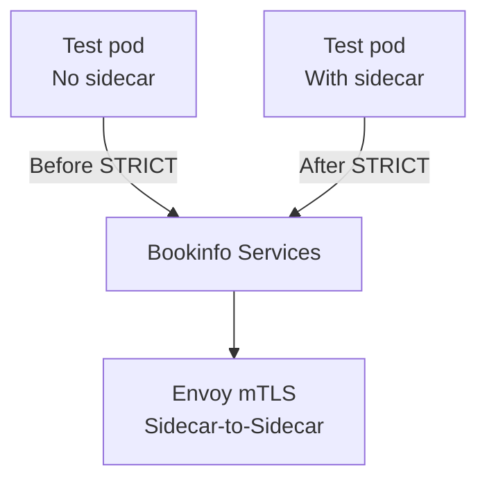
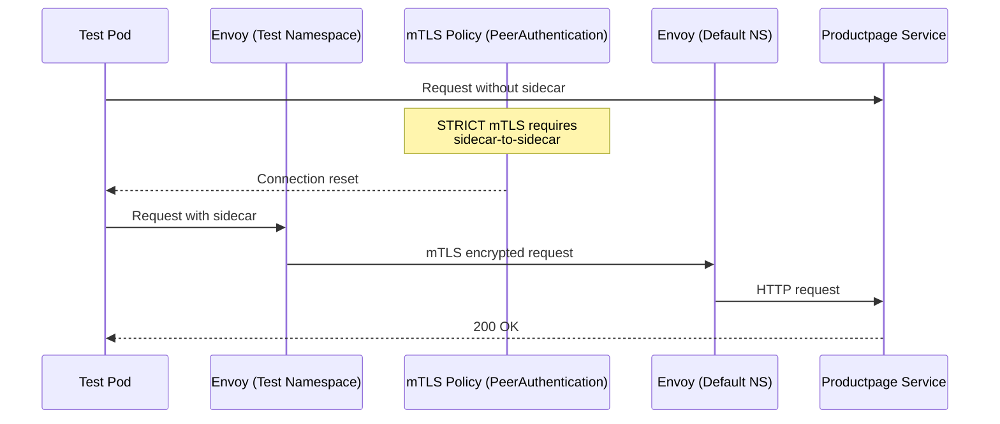
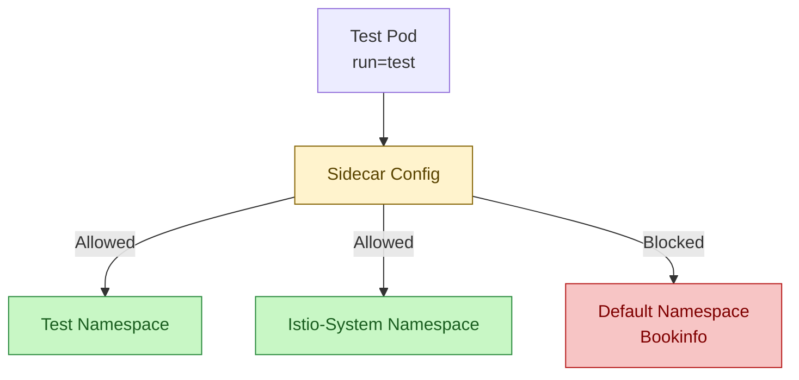
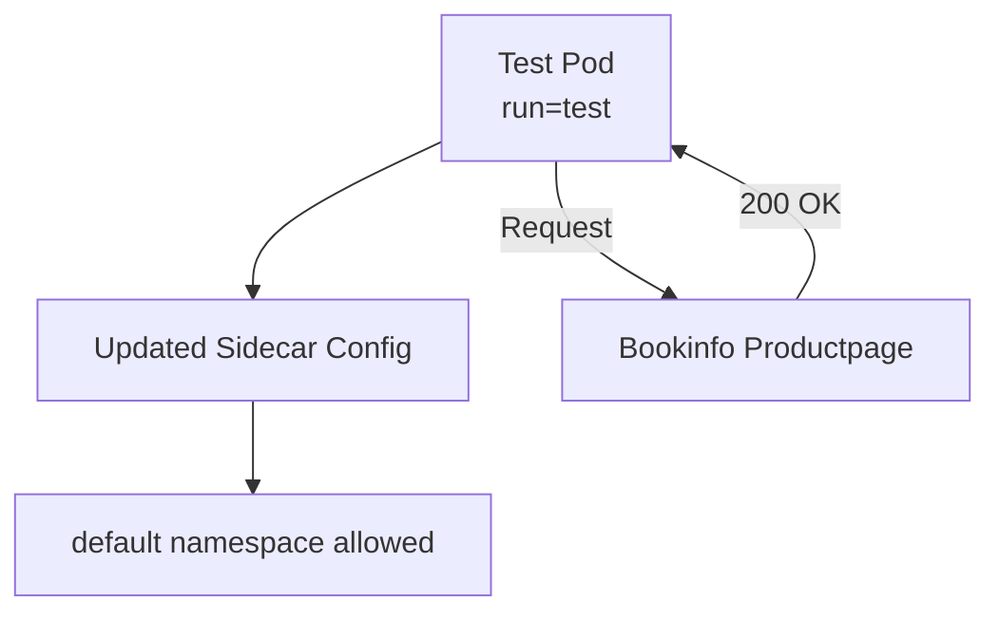
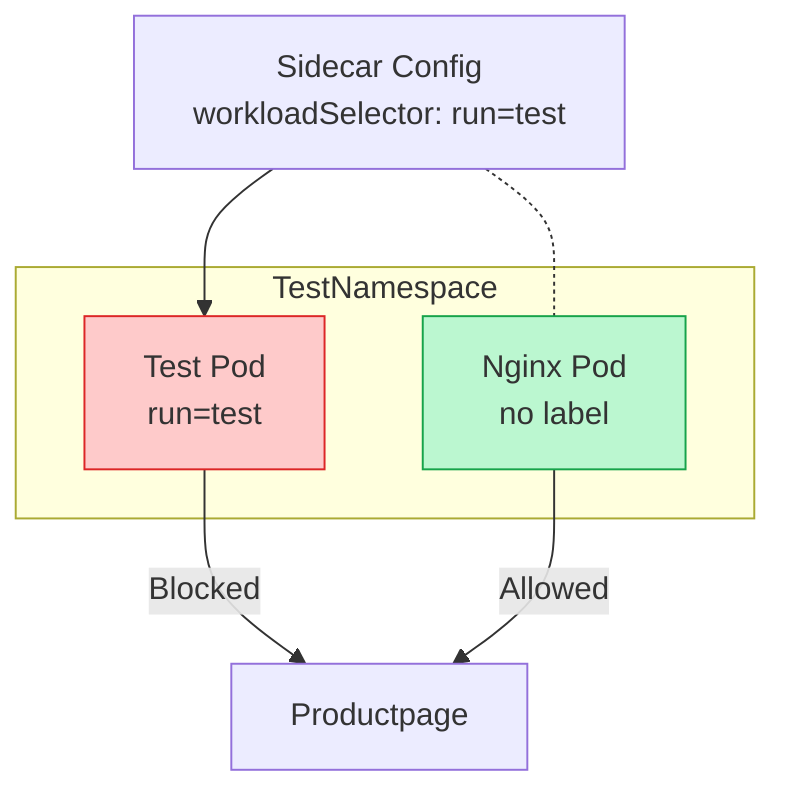

---

# 🛡️ Istio Sidecars Lab

This lab walks you through how Istio **sidecar injection**, **peer authentication**, and **sidecar configuration scoping** affect traffic flow between namespaces.

---

# 📌 1. Verify Namespace Labels

```bash
kubectl get ns --show-labels
```

---

# 📦 2. Deploy the Bookinfo Application

```bash
kubectl apply -f https://raw.githubusercontent.com/istio/istio/release-1.11/samples/bookinfo/platform/kube/bookinfo.yaml
```

Check pods:

```
NAME                              READY   STATUS    RESTARTS   AGE
details-v1-54ffb59669-f5kmt       2/2     Running   0          11m
productpage-v1-6c58956fd9-whkdn   2/2     Running   0          11m
ratings-v1-7d7546bf89-tgz68       2/2     Running   0          11m
reviews-v1-6c7fd84f89-qrxjv       2/2     Running   0          11m
reviews-v2-57bb9fdcdf-gcjxn       2/2     Running   0          11m
reviews-v3-548fc5d9c7-htc5p       2/2     Running   0          11m
```

---

# 🧪 3. Create a Test Namespace and Pod

```bash
kubectl create ns test --dry-run=client -o yaml > test_ns.yaml
kubectl apply -f test_ns.yaml
```

Create pod:

```bash
kubectl run test --image=nginx -n test --dry-run=client -o yaml > test_pod.yaml
kubectl apply -f test_pod.yaml
```

---

# 📡 4. Access Bookinfo Before PeerAuthentication

```bash
kubectl exec -ti -n test test -- /bin/bash
curl --head productpage.default.svc.cluster.local:9080
```

This works because no strict mTLS policy is applied yet.

---

# 🔐 5. Apply STRICT PeerAuthentication

```bash
kubectl apply -f peerAuthentication.yaml
kubectl get pa
```

Result:

```
NAME      MODE     AGE
default   STRICT   70s
```

Test again:

```
curl: (56) Recv failure: Connection reset by peer
```

Traffic is now **blocked** because test namespace has **no sidecar injection**.

---

# 🧩 6. Enable Sidecar Injection in the Test Namespace

```bash
kubectl label namespace test istio-injection=enabled
kubectl delete -f test_pod.yaml
kubectl apply -f test_pod.yaml
```

Test again:

```
HTTP/1.1 200 OK
```

Traffic now flows because **both sides have sidecars**.

---

# 🛑 7. Apply a Sidecar Configuration Limit

```bash
kubectl apply -f sidecar_default_namespace.yaml
```

This Sidecar resource **restricts outbound traffic** to:

* test namespace
* istio-system namespace

Now test again:

```
curl: (52) Empty reply from server
```

Blocked as expected.

---

# 🔧 8. Update Sidecar to Allow Default Namespace

Modify the YAML hosts:

```yaml
hosts:
  - "./*"
  - "default/*"
  - "istio-system/*"
```

Reapply:

```bash
kubectl apply -f sidecar_default_namespace.yaml
```

Test again:

```
HTTP/1.1 200 OK
```

---

# 🎯 9. Apply workloadSelector to Restrict Certain Pods Only

Add:

```yaml
workloadSelector:
  labels:
    run: test
```

Reapply:

```bash
kubectl apply -f sidecar_default_namespace.yaml
```

Test from **test pod**:

```
curl: (52) Empty reply from server
```

Correct — traffic is now blocked only for pods with label `run=test`.

---

# 🎉 10. Create an Unrestricted Pod (nginx)

```bash
kubectl run nginx --image=nginx -n test --dry-run=client -o yaml > nginx_pod.yaml
kubectl apply -f nginx_pod.yaml
```

Test access:

```
HTTP/1.1 200 OK
```

The nginx pod **can access** Bookinfo because the Sidecar config applies ONLY to pods labeled `run=test`.

---

# 🔷 **DIAGRAMS SECTION**

Below are all diagrams as requested.

---

# 1️⃣ High-Level Flow: Sidecar Behavior



---

# 2️⃣ mTLS Enforcement Flow



---

# 3️⃣ Outbound Restriction with Sidecar Resource



---

# 4️⃣ After Updating Allowed Hosts



---

# 5️⃣ Workload Selector Behavior




