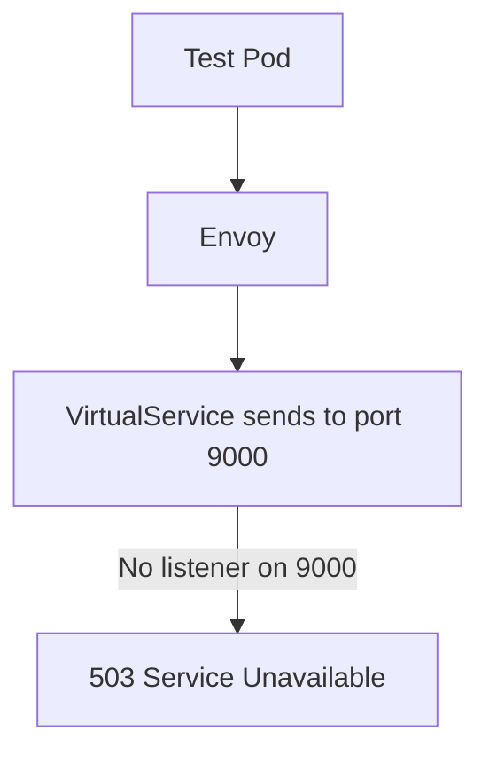

# 🌐 Istio Virtual Service Lab

This lab demonstrates how **Istio Virtual Services** control routing, port overrides, and URI rewriting for services inside the mesh.

---

# 🏁 1. Verify Istio-Enabled Namespaces

```bash
kubectl get ns --show-labels
```

Example:

```
default      Active   45m   istio-injection=enabled
istio-system Active   80s
...
```

---

# 📦 2. Deploy the HTTPBin Sample Application

```bash
kubectl apply -f https://raw.githubusercontent.com/istio/istio/master/samples/httpbin/httpbin.yaml
```

Check pods:

```bash
kubectl get pods
```

```
httpbin-686d6fc899-vlcsp   2/2   Running
```

---

# 🧪 3. Create Test Namespace and Pod

```bash
kubectl create ns test --dry-run=client -o yaml > test_ns.yaml
kubectl apply -f test_ns.yaml
kubectl run test --image=nginx -n test --dry-run=client -o yaml > test_pod.yaml
kubectl apply -f test_pod.yaml
```

---

# 🔎 4. Verify HTTPBin Service

```bash
kubectl get svc
```

```
httpbin   ClusterIP   10.107.246.109   <none>   8000/TCP
```

---

# 🧫 5. Test Service Connectivity from Test Pod

```bash
kubectl exec -ti -n test test -- curl --head httpbin.default.svc.cluster.local:8000
```

Response:

```
HTTP/1.1 200 OK
server: istio-envoy
```

---

# 🛠️ 6. Create a Virtual Service for HTTPBin

A Virtual Service named **httpbin** routes all URIs (`/`) to `httpbin.default.svc.cluster.local:8000`.

Apply:

```bash
kubectl apply -f virtualService.yaml
kubectl get vs
```

```
NAME      HOSTS         AGE
httpbin   ["httpbin"]   51s
```

Since the Virtual Service matches the current behavior, **no change** is observed.

---

# ❌ 7. Break the Virtual Service by Changing Port to 9000

Modify VirtualService → destination port **9000** (invalid):

```bash
kubectl apply -f virtualService.yaml
```

Test again:

```bash
kubectl exec -ti -n test test -- curl --head httpbin.default.svc.cluster.local:8000
```

😮 Still **200 OK** — Virtual Service is ignored.

Why?

▶ **The test namespace does NOT have Istio sidecar injection enabled**, so routing rules do not apply.

---

# ✔️ 8. Enable Sidecar Injection in Test Namespace

```bash
kubectl get ns test --show-labels
```

Add injection:

```bash
kubectl label namespace test istio-injection=enabled
kubectl delete -f test_pod.yaml
kubectl apply -f test_pod.yaml
```

Now test again:

```bash
HTTP/1.1 503 Service Unavailable
```

Correct — port 9000 is invalid, so we now see routing break as expected.

---

# 🔧 9. Fix Virtual Service & Add URI Rewrite Rule

Restore port to **8000** and add rule:

* Requests to `/hello` → rewritten to `/`

```bash
kubectl apply -f virtualService.yaml
```

Test endpoints:

```bash
curl httpbin.default.svc.cluster.local:8000/
curl httpbin.default.svc.cluster.local:8000/ip
curl httpbin.default.svc.cluster.local:8000/user-agent
curl httpbin.default.svc.cluster.local:8000/hello
```

Result:

* `/hello` → rewritten to `/`
* Other endpoints operate normally

---

# 🎉 Virtual Services enable powerful routing, port overrides, host matching, and URI rewriting inside your mesh.

---

# 📊 **DIAGRAMS**

All diagrams render correctly on GitHub.

---

## 1️⃣ **High-Level Request Flow (With & Without Injection)**

```mermaid
flowchart TD

    A[Test Pod (no sidecar)] -->|Bypasses Mesh| B[httpbin Service]
    B --> C[Direct ClusterIP Access]

    A2[Test Pod (with sidecar)] -->|Traffic Intercepted by Envoy| D[VirtualService Rules]
    D -->|Route| B
```

---

## 2️⃣ **Virtual Service Routing Logic**

```mermaid
flowchart TD

    classDef svc fill:#cce5ff,stroke:#004085,color:#003366
    classDef vs fill:#ffeeba,stroke:#8a6d3b,color:#5c4731
    classDef pod fill:#d4edda,stroke:#155724,color:#0f3e1f

    A[Test Pod<br/>Sidecar Enabled] --> B[Envoy Proxy]

    B --> C[VirtualService: httpbin]:::vs

    C -->|Match: path "/"| D[Destination<br/>httpbin.default.svc:8000]:::svc
    D --> E[httpbin Deployment]:::pod
```

---

## 3️⃣ **Broken Virtual Service (Bad Port = 9000)**



---

## 4️⃣ **URI Rewrite Rule (`/hello` → `/`)**

```mermaid
flowchart TD

    classDef rule fill:#fff3cd,stroke:#856404,color:#5a4400

    A[Test Pod] --> B[Envoy]
    B --> C[VirtualService]:::rule

    C -->|Match: /hello<br/>Rewrite: "/"| D[httpbin Deployment]
```


